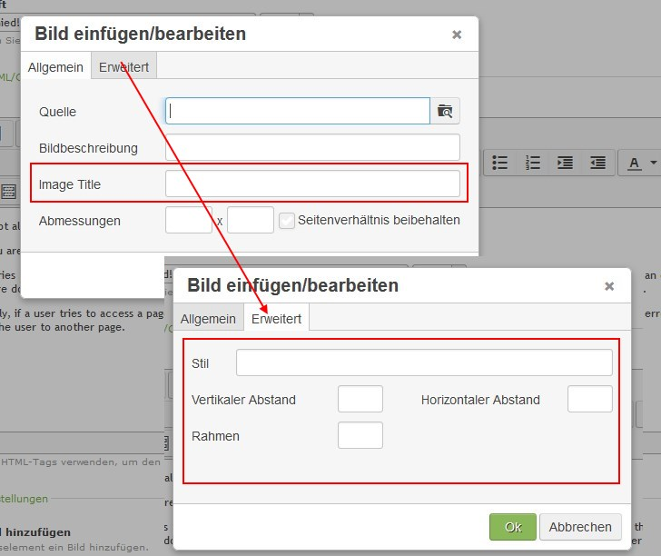

Contao Extension: TinyMceImageEnhancement
=========================================

Special TinyMCE plugin to improve the image dialog.

Installation
------------

Install the extension via composer: [cliffparnitzky/tiny-mce-image-enhancement](https://packagist.org/packages/cliffparnitzky/tiny-mce-image-enhancement).

If you prefer to install it manually, download the latest release here: https://github.com/cliffparnitzky/TinyMceImageEnhancement/releases

Tracker
-------

https://github.com/cliffparnitzky/TinyMceImageEnhancement/issues

Compatibility
-------------

- min. Contao version: >= 3.3.0
- max. Contao version: <  3.6.0

Dependency
----------

- To load this plugin and add it to the configuration the extension [[TinyMcePluginLoader]](https://github.com/cliffparnitzky/TinyMcePluginLoader) has to be installed.

Screenshot
----------

Additional information
----------------------

### Special notes

The textfield for image title (tooltip) is new since Tiny MCE 4.1.8 which is first used by Contao 3.4.5. So in Versions below Contao 3.4.5 there will be no textfield for setting this value.

### Information in the wiki

#### Create a new ...

* [Creating a new plugin](https://github.com/cliffparnitzky/TinyMcePluginLoader/wiki/Creating-a-new-plugin)
* [Creating a new bundle](https://github.com/cliffparnitzky/TinyMcePluginLoader/wiki/Creating-a-new-bundle)
* [Creating a new setup](https://github.com/cliffparnitzky/TinyMcePluginLoader/wiki/Creating-a-new-setup)

#### Installation hints
* [Install manually](https://github.com/cliffparnitzky/TinyMcePluginLoader/wiki/Install-manually)

#### Bug report hints

* [Report a bug](https://github.com/cliffparnitzky/TinyMcePluginLoader/wiki/Report-a-bug)